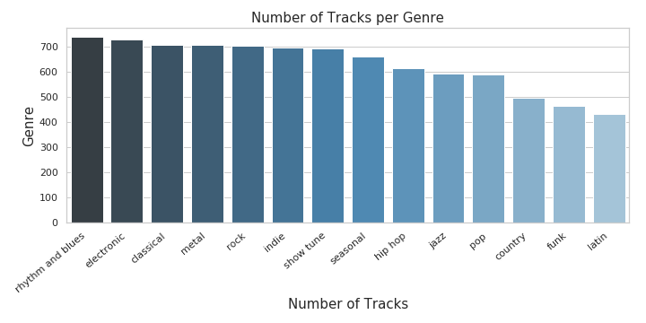
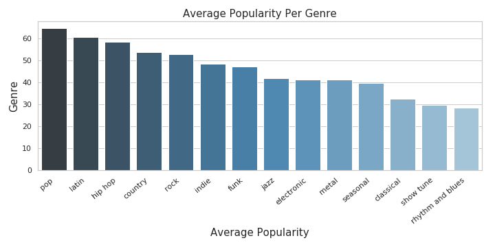
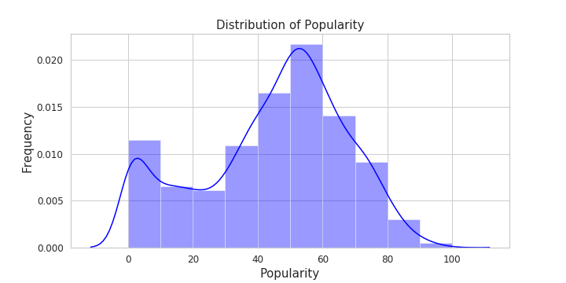
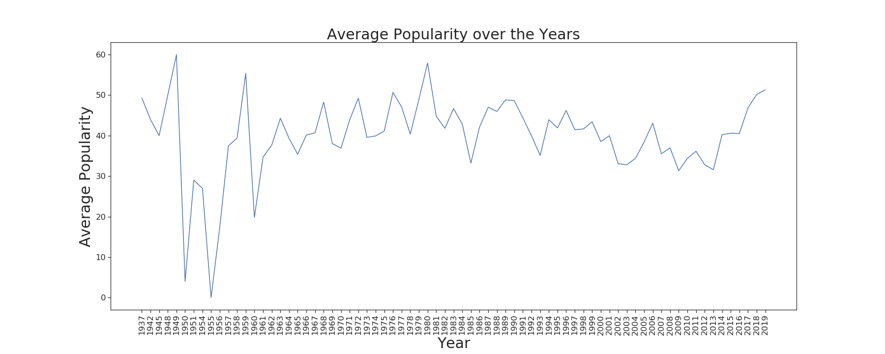

## Spotify Data Captsone

  

### Table of Contents
1. [Question](#Question)
2. [Data Cleaning](#Cleaning)
3. [Data and Visualization](#Visualization)
    1. [Release Date](#release_date)
    2. [Duplicates](#duplicates)
    3. [Data Exploration and Visualization](#dandv)
4. [Bootstrapping to Find R Value Confidence Intervals](#Bootstrap)

#### Question: Are any of the Spotify track attributes significantly correlated with track popularity? 
What makes a song popular? I would say a fast, energetic funky song that gets me up and jumping on the dance floor; my mother would say a 
a beautiful classical serenade that she can listen to while she drifts off to sleep. Spotify says that a popularity based 
on how many times the song has been streamed since its inception on Spotify and how recently that song has been streamed. 

My goal for this project is to analyze data that I have pulled from the Spotify API and see if there are any track attributes 
that are significantly correlated with track popularity. 
The track attributes I will be using to find significant relationships with song popularity: 

  - **Acousticness**
  - **Danceability**
  - **Energy**
  - **Instrumentalness**
  - **Liveness** 
  - **Loudness** 
  - **Speechiness** 
  - **Valence**
  - **Tempo**
  
### Class Creation and Data Cleaning:  
I recieved my data from the Spotify Developer API. I applied for my credentials and recieved a key and secret key to request 
data from the API. To get data from the API, I created a class called "SpotifyPlaylist" that creates a list of lists from 
user-created playlists on Spotify. I used the user_playlist function from the Spotify API documentation to create single instances of 
SpotifyPlaylist. The user_playlist function returns a json type object (a list of dictionaries embedded within dictionaries).
The functions in the SpotifyPlaylist:create_list_of_ids_for_playlists, get_data_on_one_track, and compile_all_track_data
parse through the json-like user_playlist object, pull out unique identifiers for each track on the playlis and compile 
all of the attributes and features of playlist into a list of lists. 

After I created the SpotifyPlaylist class, I created a function that returns SpotifyPlaylists based on genre. I utilized the 
search function from the Spotify API, which searches Spotify for playlists based on keywords, to return the user_id and playlist_id 
from the first ten results of playlists for the genre. For each genre, I used the user_id and playlist_id for those ten returned playlists,
to create 10 SpotifyPlaylists and then added them together to create the final playlists. Once all 17 playlists were completed, 
I put them into a Pandas DataFrame and exported them all individually to my computer. I then uploaded all of the CSVs 
to a jupyter notebook and concatenated all of the CSVs to create one DataFrame. 

### Data and Visualization: 
In the final DataFrame, there are 20 columns. The first few columns describe the track information: track name, artist, album, release date, etc.
The rest of the columns are the track attributes that are mentioned above. All of the attributes are measured quantitatively and can be interpreted 
at this link: [Attribute Descriptions](https://developer.spotify.com/documentation/web-api/reference/tracks/get-audio-features/)

#### Release Date 

To begin my EDA, I examined the datatypes of each column in my DataFrame. Every column was either a float, int, or object which falls in line with what the columns are representing. However, while looking at the release_date column, I realized that some dates were just the year of the release_date and others included the day, month, and year of the release_date. To mitigate this, I grabbed the first four characters of release_date to ensure that I would only be doing analysis on the year of the release date. 

#### Duplicates 

Soon after I examined the first few rows of data and changed datatypes that I needed to, I realized that there might be duplicate rows in my data. I split the data by genre, but that doesn't mean that there wouldn't be repeated songs and artists in the same genre or even across multiple genres. I found the duplicated rows using Pandas and deleted the first instance of those duplicates which reduced my list of 747 rows.

#### Basic Information About the Dataset 

I created two bar charts to get a better look and feel for what my dataset had to offer. The first chart shows the number of tracks that each genre has represented in the dataset. Rythym and Blues songs came in on top with more than 700 songs represented and Latin was in last place with less than 450 songs represented in the data base. 

##### Number of Tracks Per Genre

The second chart shows the average popularity score for a genre. Not surprisingly, the Pop song genre had the highest average popularity score and Rythym and Blues had the lowest score for average popularity.

##### Average Popularity Per Genre

##### Attribute Pair Plot

To familiarize myself with the track attribute data, I created a pairplot of all the attributes across all genres. Below is the resulting pairplot. Many of the relationships that I saw on this chart were random and not helpful. However, there were some scatterplots on this pairplot that I kept in mind while I continued on with my analysis: 

  

  - **Positive Correlations:**
    - Loudness and Danceability
    - Loudness and Energy 
    
  - **Negative Correlations:**
    - Energy and Liveness 
    - Danceability and Liveness 
    - Energy and Livness 
    
   - **Attribute Distributions** 
     - Declining Exponentially 
           - Speechiness, Acousticness, Instrumentalness, and Liveness 
     - Normally Distributed 
            - Danceability, Energy, Loudness, Valence 
     - Bimodal
            - Mode, Key

The pairplot made it very clear that every attribute had a different distribution.
    

 
##### Popularity Distribution Plots

After looking at the descriptive information above, I wanted to see how popularity scores were distributed across all genres. To answer this question, I created a histogram with a KDE line plot to help me understand the distribution of the popularity scores.

The popularity score distribution appears to be normally distributed skewed slightly to the right with a mean of 45.6 popularity and a standard deviation of 22.6. 

To dig deeper into this distribution, I found the proportion of songs from my sample that are very popular. I decided that a popularity score of 90 or more made a song very popular. Below is the same histogram as above, only the proportion of very popular songs is filled in with red. 

>Proportion of songs with a popularity rating of 90 or more: '0.49'%

0.49% of the population of songs is

![RegPlot]images/danceabilityvspopularity.png)

                                                                                     
                                                                                     
### Bootstrapping for R Values :
I wanted to know if any of the track attributes were statistically significantly correlated with popularity. I could not use 
the central limit theorem to provide the sampling distribution, so I proceeded using bootstrap sampling. Using this type of sampling, I created a 95% confidence interval for R values for all individual track attributes vs. popularity. For each attribute I drew 10,000 bootstrap samples from my main sample, computed my R values for each bootstrap sample, and found the 
95% confidence interval by finding the 0.025 and 0.975 percentiles of the bootstrapped R values. 

#### Results: 
With 95% confidence, I can conclude that only one track feature has a statistically significant relationship with popularity: danceability. The resulting danceability confidence interval: 
>Bootstrap Confidence Interval for Population R Value: [0.02, 0.40]

The way I interpreted my boo
