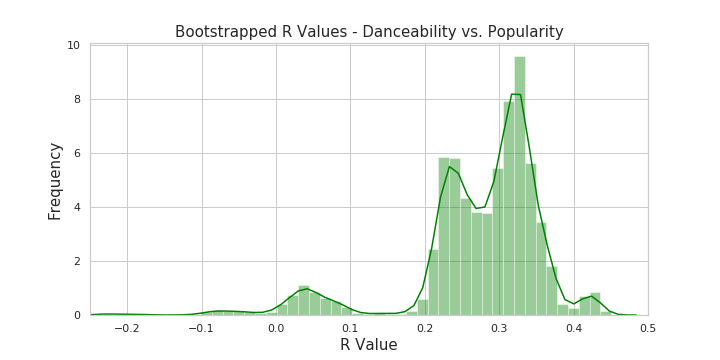

## Spotify Data Captsone
#### Question: Are any of the Spotify track attributes significantly correlated with track popularity? 
What makes a song popular? I would say a fast, energetic funky song that gets me up and jumping on the dance floor; my mother would say a 
a beautiful classical serenade that she can listen to while she drifts off to sleep. Spotify says that a popular based 
on how many times the song has been streamed since its inception on Spotify and how recently that song has been streamed. 

My goal for this project is to analyze data that I have pulled from the Spotify API and see if there are any track attributes 
that are significantly correlated with track popularity. 
The track attributes I will be using to find significant relationships with song popularity: 

  - Acousticness
  - Danceability
  - Energy
  - Instrumentalness
  - Liveness 
  - Loudness 
  - Speechiness 
  - Valence
  - Tempo
  

  

  
### Class Creation and Data Cleaning: 
I recieved my data from the Spotify Developer API. I applied for my credentials and recieved a key and secret key to request 
data from the API. To get data from the API, I created a class called "SpotifyPlaylist" that creates a list of lists from 
user-created playlists on Spotify. I used the user_playlist function from the Spotify API documentation to create single instances of 
SpotifyPlaylist. The user_playlist function returns a json type object (a list of dictionaries embedded within dictionaries).
The functions in the SpotifyPlaylist:create_list_of_ids_for_playlists, get_data_on_one_track, and compile_all_track_data
parse through the json-like user_playlist object, pull out unique identifiers for each track on the playlis and compile 
all of the attributes and features of playlist into a list of lists. 

After I created the SpotifyPlaylist class, I created a function that returns SpotifyPlaylists based on genre. I utilized the 
search function from the Spotify API, which searches Spotify for playlists based on keywords, to return the user_id and playlist_id 
from the first ten results of playlists for the genre. For each genre, I used the user_id and playlist_id for those ten returned playlists,
to create 10 SpotifyPlaylists and then added them together to create the final playlists. Once all 17 playlists were completed, 
I put them into a Pandas DataFrame and exported them all individually to my computer. I then uploaded all of the CSVs 
to a jupyter notebook and concatenated all of the CSVs to create one DataFrame. 

### Data: 
In the final DataFrame, there are 20 columns. The first few columns describe the track information: track name, artist, album, release date, etc.
The next rows are the track attributes that are mentioned above. All of the attributes are measured quantitatively and can be interpreted 
at this link: [Attribute Descriptions](https://developer.spotify.com/documentation/web-api/reference/tracks/get-audio-features/)

### Bootstrapping for R Values
I wanted to know if any of the track attributes were statistically significantly correlated with popularity. I could not use 
the central limit theorem to provide the sampling distribution, so I proceeded using bootstrap sampling. Using this type of sampling, I created a 95% confidence interval for R values for all individual track attributes vs. popularity. For each attribute I drew 10,000 bootstrap samples from my main sample, computed my R values for each bootstrap sample, and found the 
95% confidence interval by finding the 0.025 and 0.975 percentiles of the bootstrapped R values. 

#### Results: 
With 95% confidence, I can conclude that only one track feature has a statistically significant relationship with popularity: danceability. The resulting danceability confidence interval: 
>Bootstrap Confidence Interval for Population R Value: [0.02, 0.40]

 
 

The way I interpreted my boo
